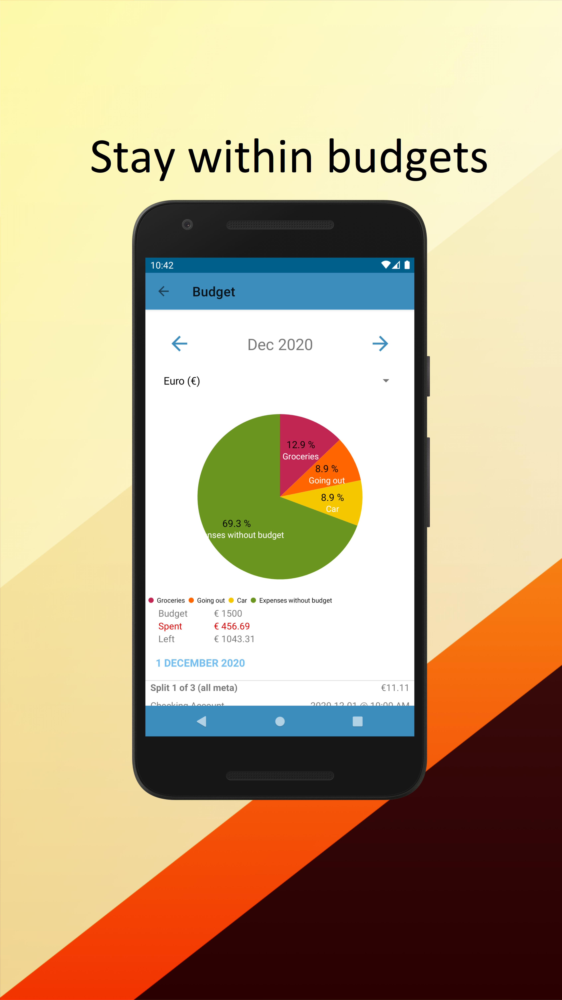

### Photuris III

[](https://foss.hisname.xyz/fdroid/firefly/)[](https://play.google.com/store/apps/details?id=xyz.hisname.fireflyiii)

[](https://appgallery.cloud.huawei.com/ag/n/app/C103828127?channelId=Github&referrer=github&id=7763ad17e2094e4b9271c7da25c16cba&s=6FEF9547A0C4F0B10A8E4ABB775633E77BE6EB822E07108BDBA09CBC1E9F02D8&detailType=0&v=)				

[](https://img.shields.io/github/contributors/emansih/FireflyMobile) 
[](https://img.shields.io/github/license/emansih/FireflyMobile.svg) 
[](https://liberapay.com/hisname/donate)
[](https://github.com/emansih/FireflyMobile/releases/latest)
            
Photuris III is an **unofficial** Android client for [Firefly III](https://github.com/firefly-iii/firefly-iii), written in Kotlin. 
"Firefly III" is a (self-hosted) manager for your personal finances. It can help you keep track of your expenses and income, so you can spend less and save more. 
Firefly III supports the use of budgets, categories and tags. Using a bunch of external tools, you can import data. It also has many neat financial reports available.
Firefly III should give you insight into and control over your finances. Money should be useful, not scary.


### Authentication

Check the [wiki page](https://github.com/emansih/FireflyMobile/wiki/Authentication) for more info


### Features

✔ Support Marshmallow and up!

✔ Manage your finances on the go: Access your Firefly III data even when it is unreachable from the outside world

✔ Automation: Automate adding transactions. Read the [wiki](https://github.com/emansih/FireflyMobile/wiki/Automation-via-Android-Intents) for more info.

✔ Meaningful Reports: Financial reports give you overview of your spending and income within the app

✔ Enhanced Features: Attach multiple attachments 📎 / add time 🕐 to your transactions 


#### Downloads

To get latest update notifications, either add [this RSS feed](https://github.com/emansih/FireflyMobile/releases.atom) or click on the watch button.  

To support development of this software, you can purchase the app via [Google Play](https://play.google.com/store/apps/details?id=xyz.hisname.fireflyiii) or [Huawei App Gallery](https://appgallery.cloud.huawei.com/ag/n/app/C103828127?channelId=Github&referrer=github&id=7763ad17e2094e4b9271c7da25c16cba&s=6FEF9547A0C4F0B10A8E4ABB775633E77BE6EB822E07108BDBA09CBC1E9F02D8&detailType=0&v=)

It's also available via official F-Droid [here](https://f-droid.org/packages/xyz.hisname.fireflyiii/). I have also added my own F-Droid repo. For more info, take a look [on my website](https://foss.hisname.xyz/fdroid/firefly/)

### Screenshots

Dashboard | Monitor your accounts | Stay within your budget |
| :-: | :-: | :-: |
 |  | 

| Track your expenses | Add transactions on the go | Pay your bills on time 
| :-: | :-: | :-: |
|  |  | 

Thanks to [Device Shots](https://deviceshots.com/) for the device frame!

## Contributing

### Reporting Bugs

Found a bug? Before reporting it, check the [issue page](https://github.com/emansih/FireflyMobile/issues) to see if I am aware of it. If not, simply open up the [issue form](https://github.com/emansih/FireflyMobile/issues/new?template=ISSUE_TEMPLATE.md) and fill it up. Please attach a stacktrace together with the bug report. 


### Contributing

How do I join/contribute to Photuris III? I am open to any kind of suggestions/feature request! Open an issue or drop me an email(Can be found on my Github profile). 

### Contributors
This project exists thanks to all the people who [contributed](https://github.com/emansih/FireflyMobile/graphs/contributors).
Icons in this app are taken from:
1. [Flaticon](https://www.flaticon.com/free-icon/piggy-bank-with-dollar-coin_21239)
2. [Material Design Icons](https://materialdesignicons.com)
3. [Android Iconics](https://github.com/mikepenz/Android-Iconics)
4. App icon taken from Firefly III. [Original source](https://www.kissclipart.com/dinero-no-png-clipart-service-751-05-jh4t51/download-clipart.html)


### License
```
    Copyright (C) 2018 - 2021 Daniel Quah(emansih)
	Copyright (c) 2021 ASDF Dev Pte. Ltd.

    This program is free software: you can redistribute it and/or modify
    it under the terms of the GNU General Public License as published by
    the Free Software Foundation, either version 3 of the License, or
    (at your option) any later version.

    This program is distributed in the hope that it will be useful,
    but WITHOUT ANY WARRANTY; without even the implied warranty of
    MERCHANTABILITY or FITNESS FOR A PARTICULAR PURPOSE.  See the
    GNU General Public License for more details.

    You should have received a copy of the GNU General Public License
    along with this program.  If not, see <http://www.gnu.org/licenses/>.
```